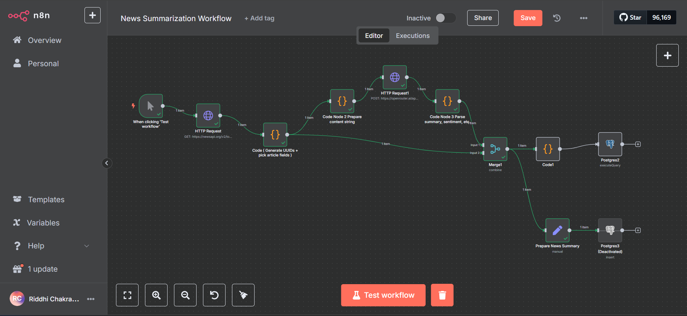

# News Summarization Workflow with n8n + Nhost (Hasura)

This repository contains an **n8n workflow** that automates the process of fetching news articles, summarizing them using an AI model via OpenRouter, analyzing sentiment, and storing the processed data in a PostgreSQL database powered by **Nhost + Hasura**.

---

## Workflow Overview

1. **Trigger:** The workflow starts manually via the "Test workflow" trigger node.
2. **HTTP Request (NewsAPI):** Fetches top headlines from [NewsAPI](https://newsapi.org).
3. **Code Node 1:** Generates UUIDs and extracts required fields from the fetched articles.
4. **Code Node 2:** Prepares the content string for summarization.
5. **HTTP Request (OpenRouter):** Sends article content to OpenRouter for summarization and sentiment analysis.
6. **Code Node 3:** Parses AI output — includes summary, sentiment, etc.
7. **Merge Node:** Merges original and AI-enriched data.
8. **Final Code Node:** Formats data into a GraphQL-compatible format.
9. **HTTP Request (Hasura/Nhost):** Sends the data using a GraphQL mutation to Nhost's Hasura backend.

---

## Tech Stack

- **n8n** (Automation workflow engine)
- **Nhost** (PostgreSQL + Hasura backend)
- **OpenRouter** (AI summarization + sentiment API)
- **NewsAPI** (News source)
- **GraphQL** (Data mutation into Hasura)

---

## ⚙️ Requirements

- [n8n](https://n8n.io) instance
- [Nhost](https://nhost.io) project (with Hasura access)
- [NewsAPI](https://newsapi.org) key
- [OpenRouter](https://openrouter.ai) API key

---

## 🧪 Features

- 🧠 AI-Powered Summarization & Sentiment via OpenRouter
- 🔐 Secure GraphQL integration with Hasura
- 🔀 UUID and formatting handled via Code nodes
- ⚡ Optimized to run on-demand or on schedule

